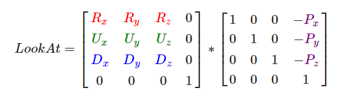

# 计算机图形学期末项目 -- 个人报告


## 姓名：陈明亮


## 学号：16340023

## Github账号：Palette25


### 负责部分：

1. `Camera Roaming` - 摄像机的自由移动

2. `Texture Mapping` - 纹理贴图渲染

3. `Model Import && Mesh Viewing `- 模型加载

4. `Display Text `- 显示文字(平面)

5. `Particle System `- 粒子系统：渲染雪

6. `Game Rules Making` - 项目游戏规则制定

7. `Skeletal Animation` - 骨骼动画

8. `Collision Detection` - 碰撞检测

   ​


### 功能实现：

#### 摄像机系统
关于摄像机的创建，与自由移动，实际上在课程作业中已经实现过，此处大致概括相关原理：

1. 首先需要确定摄像机位置，同时根据LookAt矩阵约束摄像机的观察方向，LookAt矩阵由方向向量D，右向量R，和上向量U组成的矩阵与摄像机位置向量的乘积得到：
  

  ```c++
  // 相机的位置
  glm::vec3 Position = glm::vec3(0.0f, 2.0f, 0.0f);
  // 相机的前向量
  glm::vec3 Front = glm::vec3(1.0f, 0.0f, 0.0f);
  // 相机的上向量
  glm::vec3 Up = glm::vec3(0.0f, 1.0f, 0.0f);
  // 相机的右向量
  glm::vec3 Right;
  // 观察坐标
  glm::vec3 WorldUp = glm::vec3(0.0f, 0.0f, 0.0f);
  ```


2. 视觉移动依赖于摄像机的欧拉角转动，利用欧拉角（Euler Angle），通过在3D空间中旋转的三个值（pitch, yaw, roll）进行视角的移动。利用它们的结合，我们可以算出3D空间中的任何旋转的向量。
  

  这三个值的定义如下：

  - 俯仰角，描述如何往上或往下看的角

  - 偏航角，左右看的程度

  - 滚转角，摄像机翻滚的程度

    ​


  俯仰角是描述我们如何往上或往下看的角，可以在第一张图中看到。第二张图展示了偏航角，偏航角表示我们往左和往右看的程度。滚转角代表我们如何**翻滚**摄像机，通常在太空飞船的摄像机中使用。每个欧拉角都有一个值来表示，把三个角结合起来我们就能够计算3D空间中任何的旋转向量了。

  给定一个俯仰角和偏航角，我们可以把它们转换为一个代表新的方向向量的3D向量。俯仰角和偏航角转换为方向向量的处理需要一些三角学知识，我们先从最基本的情况开始：

  

  如果我们把斜边边长定义为1，我们就能知道邻边的长度是`cos x/h=cos x/1=cos x`，它的对边是`sin y/h=sin y/1=sin y`。这样我们获得了能够得到x和y方向长度的通用公式，它们取决于所给的角度。我们使用它来计算方向向量的分量：

  

  ```c++
  void Camera::updateCameraVectors() {
      // Calculate the new Front vector
      glm::vec3 front;
      front.x = cos(glm::radians(Yaw)) * cos(glm::radians(Pitch));
      front.y = sin(glm::radians(Pitch));
      front.z = sin(glm::radians(Yaw)) * cos(glm::radians(Pitch));
      Front = glm::normalize(front);
      // Also re-calculate the Right and Up vector
      Right = glm::normalize(glm::cross(Front,WorldUp));  
      Up = glm::normalize(glm::cross(Right, Front));
  }
  ```


3. 设置完基本的摄像机类之后，我们需要根据键盘和鼠标的输入，更改摄像机的位置，观察方向和欧拉角值，检测键盘输入往往通过`processInput()`函数实现：

   键盘`W-A-S-D`按键会将移动方向传入到摄像机类中，摄像机类根据传入的移动方向进行位置更新：

   ```c++
   if (glfwGetKey(window, GLFW_KEY_W) == GLFW_PRESS)
   	camera.ProcessKeyboard(FORWARD, deltaTime);
   if (glfwGetKey(window, GLFW_KEY_S) == GLFW_PRESS)
   	camera.ProcessKeyboard(BACKWARD, deltaTime);
   if (glfwGetKey(window, GLFW_KEY_A) == GLFW_PRESS)
   	camera.ProcessKeyboard(LEFT, deltaTime);
   if (glfwGetKey(window, GLFW_KEY_D) == GLFW_PRESS)
   	camera.ProcessKeyboard(RIGHT, deltaTime);
   ```

   ```c++
   void Camera::ProcessKeyboard(Camera_Movement direction, float deltaTime) {
       float velocity = MovementSpeed * deltaTime;
       if (direction == FORWARD)
           Position += Front * velocity;
       if (direction == BACKWARD)
           Position -= Front * velocity;
       if (direction == LEFT)
           Position -= Right * velocity;
       if (direction == RIGHT)
           Position += Right * velocity;
   }
   ```

   ​

   鼠标移动修改摄像机观察方向，通过绑定`mouse_callback()`函数进行，并将鼠标的移动信息传递给摄像机，摄像机再进行欧拉角的属性值修改：

   ```c++
   void mouse_callback(GLFWwindow *window, double xpos, double ypos) {
       if (firstMouse) {
           lastX = xpos;
           lastY = ypos;
           firstMouse = false;
       }

       float xoffset = xpos - lastX;
       float yoffset = lastY - ypos; // reversed since y-coordinates go from bottom to top

       lastX = xpos;
       lastY = ypos;

       camera.ProcessMouseMovement(xoffset, yoffset);
   }
   ```

   ```c++
   void Camera::ProcessMouseMovement(float xoffset, float yoffset, GLboolean constrainPitch) {
       xoffset *= MouseSensitivity;
       yoffset *= MouseSensitivity;

       Yaw += xoffset;
       Pitch += yoffset;

       // Make sure that when pitch is out of bounds, screen doesn't get flipped
       if (constrainPitch) {
           if (Pitch > 89.0f)
               Pitch = 89.0f;
           if (Pitch < -89.0f)
               Pitch = -89.0f;
       }

       // Update Front, Right and Up Vectors using the updated Euler angles
       updateCameraVectors();
   }
   ```

   ​

#### 纹理贴图

1. 结合`stb_image.h`编写加载纹理的函数`loadTexture()`:

   ```c++
   unsigned int CubeRender::loadTexture(const GLchar *path) {
       unsigned int textureID;
       glGenTextures(1, &textureID);

       glBindTexture(GL_TEXTURE_2D, textureID);

       int width, height, nrChannels;
       unsigned char *data = stbi_load(path, &width, &height, &nrChannels, 0);
       if (data) {
           GLenum format = nrChannels == 3 ? GL_RGB : GL_RGBA;
           glTexImage2D(GL_TEXTURE_2D, 0, format, width, height, 0, 
           							format, GL_UNSIGNED_BYTE, data);
           stbi_image_free(data);
           //glGenerateMipmap(GL_TEXTURE_2D);
           glTexParameteri(GL_TEXTURE_2D, GL_TEXTURE_WRAP_S, GL_MIRRORED_REPEAT);
           glTexParameteri(GL_TEXTURE_2D, GL_TEXTURE_WRAP_T, GL_MIRRORED_REPEAT);
           glTexParameteri(GL_TEXTURE_2D, GL_TEXTURE_MIN_FILTER, GL_NEAREST);
           glTexParameteri(GL_TEXTURE_2D, GL_TEXTURE_MAG_FILTER, GL_NEAREST);
           glBindTexture(GL_TEXTURE_2D, 0);
       } else {
           std::cout << "Cubemap texture failed to load at path: " << path << std::endl;
           stbi_image_free(data);
       }
       return textureID;
   }
   ```

   ​

2. 项目中的沙滩场景，以及水流场景，树木场景，均通过构建基本的正方体，然后在其上使用纹理贴图来构建的，故此处需要展示如何将贴图渲染到正方体上：

   将渲染正方体细分为渲染不同面

   ```c++
   void CubeRender::RenderCube(unsigned int texture, unsigned int drawCount) {
       RenderFace(texture, TOP, drawCount);
       RenderFace(texture, BOTTOM, drawCount);
       RenderFace(texture, LEFT, drawCount);
       RenderFace(texture, RIGHT, drawCount);
       RenderFace(texture, FRONT, drawCount);
       RenderFace(texture, BACK, drawCount);
   }
   ```

   渲染不同面，根据定义的顶点数组进行贴图材质的绑定：

   ```c++
   void CubeRender::RenderFace(unsigned int texture, RenderDir dir, unsigned int drawCount) {
       glActiveTexture(GL_TEXTURE0);
       glBindTexture(GL_TEXTURE_2D, texture);
       if (dir == TOP) {
           glBindVertexArray(cubeVAO_top);
       } else if (dir == BOTTOM) {
           glBindVertexArray(cubeVAO_bottom);
       } else if (dir == FRONT) {
           glBindVertexArray(cubeVAO_front);
       } else if (dir == BACK) {
           glBindVertexArray(cubeVAO_back);
       } else if (dir == LEFT) {
           glBindVertexArray(cubeVAO_left);
       } else if (dir == RIGHT) {
           glBindVertexArray(cubeVAO_right);
       }
       if (dir != CROSS) {
           // Render Cube
           glDrawArraysInstanced(GL_TRIANGLES, 0, 6, drawCount);
           glBindVertexArray(0);
       } else {
           glBindVertexArray(crossVAO);
           // Render Cube
           glDrawArraysInstanced(GL_TRIANGLES, 0, 12, drawCount);
           glBindVertexArray(0);
       }
   }
   ```

   ​

3. 除此之外，还支持多张纹理贴图的交替渲染，项目中的海水的动画就是通过加载多张贴图，然后通过周期性渲染得到的(效果十分初步)

   ```c++
   unsigned int *CubeRender::loadTextures(const GLchar *path, int count) {
       unsigned int *textures = new unsigned int[count];
       int width, height, nrChannels;
       unsigned char *data = stbi_load(path, &width, &height, &nrChannels, 0);
       if (data) {
           // 进行图片的切分
           int singleHeight = height / count;

           for (int i = 0; i < count; i++) {
               // Create Texture
               glGenTextures(1, &textures[i]);
               glBindTexture(GL_TEXTURE_2D, textures[i]);
               GLenum format = nrChannels == 3 ? GL_RGB : GL_RGBA;
               glTexImage2D(GL_TEXTURE_2D, 0, format, width, singleHeight, 
                            0, format, GL_UNSIGNED_BYTE,
                            data + (nrChannels * width * singleHeight) * i);
               //glGenerateMipmap(GL_TEXTURE_2D);
               glTexParameteri(GL_TEXTURE_2D, GL_TEXTURE_WRAP_S, GL_MIRRORED_REPEAT);
               glTexParameteri(GL_TEXTURE_2D, GL_TEXTURE_WRAP_T, GL_MIRRORED_REPEAT);
               glTexParameteri(GL_TEXTURE_2D, GL_TEXTURE_MIN_FILTER, GL_NEAREST);
               glTexParameteri(GL_TEXTURE_2D, GL_TEXTURE_MAG_FILTER, GL_NEAREST);
               glBindTexture(GL_TEXTURE_2D, 0);
           }
           stbi_image_free(data);
           return textures;
       } else {
           std::cout << "Cubemap texture failed to load at path: " << path << std::endl;
           stbi_image_free(data);
           return NULL;
       }
       return NULL;
   }
   ```

   ​

#### 模型加载

1. 模型加载使用了`Assimp`库，首先需要定义`Mesh`网格类，将`.obj`文件中的顶点数据通过网格类的形式存储，渲染，最终再组合成一个整体的模型得以展示：

   模型文件中，对于顶点数据的描述往往有以下各种属性：

   ```c++
   struct Vertex {
       // position
       glm::vec3 Position;
       // normal
       glm::vec3 Normal;
       // texCoords
       glm::vec2 TexCoords;
       // tangent
       glm::vec3 Tangent;
       // bitangent
       glm::vec3 Bitangent;
   };
   ```

   网格类定义：

   ```c++
   class Mesh {
       public:
           /*  网格数据  */
           vector<Vertex> vertices;
           vector<unsigned int> indices;
           vector<Texture> textures;
           /*  函数  */
           Mesh(vector<Vertex> vertices, vector<unsigned int> indices, vector<Texture> textures);
           void Draw(Shader shader);
       private:
           /*  渲染数据  */
           unsigned int VAO, VBO, EBO;
           /*  函数  */
           void setupMesh();
   };  
   ```

   ​

   网格类的渲染功能实现，在`opengl`教程的原有代码上进行增加，为网格贴图的属性增加了`color_diffuse`，防止针对于某些模型，网格渲染不显示颜色的问题：

   ```c++
   // render the mesh
   void Draw(Shader *shader) {
       // bind appropriate textures
       unsigned int diffuseNr = 0;
       unsigned int specularNr = 0;
       unsigned int normalNr = 0;
       unsigned int heightNr = 0;
       for (unsigned int i = 0; i < textures.size(); i++) {
       string number;
       string name = textures[i].type;

       if (name == "texture_diffuse")
       	number = std::to_string(diffuseNr++);
       else if (name == "texture_specular")
       	number = std::to_string(specularNr++);
       else if (name == "texture_normal")
       	number = std::to_string(normalNr++);
       else if (name == "texture_height")
       	number = std::to_string(heightNr++);
       else if (name == "color_diffuse") {
           shader->SetVector3f("sprite_color", textures[i].color);
           shader->SetInteger("type", 1);
       	continue;
       }
       shader->SetVector3f("sprite_color", glm::vec3(1, 1, 1));
       shader->SetInteger("type", 2);

       glActiveTexture(GL_TEXTURE0 + i);
       glUniform1i(glGetUniformLocation(shader->ID, (name + number).c_str()), i);
       // and finally bind the texture
       glBindTexture(GL_TEXTURE_2D, textures[i].id);
       }

       // draw mesh
       glBindVertexArray(VAO);
       glDrawElements(GL_TRIANGLES, indices.size(), GL_UNSIGNED_INT, 0);
       glBindVertexArray(0);

       // always good practice to set everything back to defaults once configured.
       glActiveTexture(GL_TEXTURE0);
   }
   ```

   ​

2. 实现网格类之后，我们需要通过构建网格组成的模型类，模型类的基本定义如下：

   ```c++
   class Model {
   public:
       /*  Model Data */
       vector<Texture> textures_loaded
       vector<Mesh> meshes;
       string directory;
       bool gammaCorrection;

       /*  Functions   */
       // constructor, expects a filepath to a 3D model.
       explicit Model(string const &path);
       
       // draws the model, and thus all its meshes
       void Draw(Shader *shader);

       void LoadModel(string const &path);

       private:
           void processNode(aiNode *node, const aiScene *scene);
           Mesh processMesh(aiMesh *mesh, const aiScene *scene);

           vector<Texture> loadMaterialColor(aiMaterial *mat, const char *pKey, unsigned int type,
                                                unsigned int idx, string typeName);

           vector<Texture> loadMaterialTextures(aiMaterial *mat, 
                                                aiTextureType type, string typeName);
   };
   ```
   ​

   模型类的`Draw`函数逻辑十分简单，只需要将其现有的所有`Mesh`对象遍历一遍，各自调用其`Draw`函数即可。

   难点在于如何将模型导入`OpenGL`，再根据导入的模型，处理其顶点，生成网格对象

   要想导入一个模型，并将它转换到我们自己的数据结构中的话，首先我们需要包含Assimp对应的头文件：

   ```c++
   #include <assimp/Importer.hpp>
   #include <assimp/scene.h>
   #include <assimp/postprocess.h>
   ```

   多亏了`Assimp`库，我们可以通过一行代码，将模型文件直接导入程序中：

   ```c++
   Assimp::Importer importer;
   const aiScene *scene = importer.ReadFile(path, aiProcess_Triangulate | aiProcess_FlipUVs);
   ```

   完整的加载模型函数：

   ```c++
   void loadModel(string path)
   {
       Assimp::Importer import;
       const aiScene *scene = import.ReadFile(path, aiProcess_Triangulate | aiProcess_FlipUVs);    

       if(!scene || scene->mFlags & AI_SCENE_FLAGS_INCOMPLETE || !scene->mRootNode) 
       {
           cout << "ERROR::ASSIMP::" << import.GetErrorString() << endl;
           return;
       }
       directory = path.substr(0, path.find_last_of('/'));

       processNode(scene->mRootNode, scene);
   }
   ```

   Assimp的结构中，每个节点包含了一系列的网格索引，每个索引指向场景对象中的那个特定网格。我们接下来就想去获取这些网格索引，获取每个网格，处理每个网格，接着对每个节点的子节点重复这一过程，加载节点信息的函数定义如下：

   ```c++
   void processNode(aiNode *node, const aiScene *scene)
   {
       // 处理节点所有的网格（如果有的话）
       for(unsigned int i = 0; i < node->mNumMeshes; i++)
       {
           aiMesh *mesh = scene->mMeshes[node->mMeshes[i]]; 
           meshes.push_back(processMesh(mesh, scene));         
       }
       // 接下来对它的子节点重复这一过程
       for(unsigned int i = 0; i < node->mNumChildren; i++)
       {
           processNode(node->mChildren[i], scene);
       }
   }
   ```

   我们首先检查每个节点的网格索引，并索引场景的mMeshes数组来获取对应的网格。返回的网格将会传递到processMesh函数中，它会返回一个Mesh对象，我们可以将它存储在meshes列表/vector。

   所有网格都被处理之后，我们会遍历节点的所有子节点，并对它们调用相同的processMesh函数。当一个节点不再有任何子节点之后，这个函数将会停止执行。

   ```c++
   Mesh processMesh(aiMesh *mesh, const aiScene *scene)
   {
       vector<Vertex> vertices;
       vector<unsigned int> indices;
       vector<Texture> textures;

       for(unsigned int i = 0; i < mesh->mNumVertices; i++)
       {
           Vertex vertex;
           // 处理顶点位置、法线和纹理坐标
           ...
           vertices.push_back(vertex);
       }
       // 处理索引
       ...
       // 处理材质
       if(mesh->mMaterialIndex >= 0)
       {
           ...
       }

       return Mesh(vertices, indices, textures);
   }
   ```

   处理网格的过程主要有三部分：获取所有的顶点数据，获取它们的网格索引，并获取相关的材质数据。处理后的数据将会储存在三个vector当中，我们会利用它们构建一个Mesh对象，并返回它到函数的调用者那里。


#### 显示平面文字

文字显示使用了`freetype`库，在渲染文字前首先需要定义文字显示的信息结构体：

```c++
struct Character {
    GLuint TextureID;   // ID handle of the glyph texture
    glm::ivec2 Size;    // Size of glyph
    glm::ivec2 Bearing;  // Offset from baseline to left/top of glyph
    GLuint Advance;    // Horizontal offset to advance to next glyph
};
```

在每一渲染一个单独的文字时，根据文字对应的字母，首先需要将其转换成`Character`类对象，这部分`freeetype`库已经帮我们完成了：

```c++
Character ch = this->Characters[*c]; // *c即为一个字符
```

获取到字符对应的`Character`对象之后，根据`freetype`二维渲染样式，只需要通过创建固定格式的VAO，VBO即可完成渲染过程：

```c++
GLfloat xpos = postion.x + ch.Bearing.x * scale;
GLfloat ypos = postion.y - (ch.Size.y - ch.Bearing.y) * scale;

GLfloat w = ch.Size.x * scale;
GLfloat h = ch.Size.y * scale;
// Update VBO for each character
GLfloat vertices[6][4] = {
    {xpos,     ypos + h, 0.0, 0.0},
    {xpos,     ypos,     0.0, 1.0},
    {xpos + w, ypos,     1.0, 1.0},

    {xpos,     ypos + h, 0.0, 0.0},
    {xpos + w, ypos,     1.0, 1.0},
    {xpos + w, ypos + h, 1.0, 0.0}
};
// Render glyph texture over quad
glBindTexture(GL_TEXTURE_2D, ch.TextureID);
// Update content of VBO memory
glBindBuffer(GL_ARRAY_BUFFER, this->fontVBO);
glBufferSubData(GL_ARRAY_BUFFER, 0, sizeof(vertices),
					vertices); // Be sure to use glBufferSubData and not glBufferData

glBindBuffer(GL_ARRAY_BUFFER, 0);
// Render quad
glDrawArrays(GL_TRIANGLES, 0, 6);
// Now advance cursors for next glyph (note that advance is number of 1/64 pixels)
postion.x += (ch.Advance >> 6) * scale;
```


#### 粒子系统

粒子系统的实现的主要过程为：定义粒子结构体存储每个粒子的位置，大小，速度，方向，以及年龄信息，在主渲染函数中，通过随机生成粒子位置(当然一般下雪的话粒子位置都是在上方)，根据时间实时更新粒子的位置，实现缓慢落下的功能，当粒子的年龄到达范围时，将该粒子移除，生成新的粒子，重复上述操作，即可实现下雪的效果。

```c++
struct SnowParticle
{
	float type;
	glm::vec3 position;
	glm::vec3 velocity;
    glm::vec3 direction;
	float lifetimeMills;//年龄
	float size;//粒子点精灵大小
};
```

```c++
class Snow
{
public:
	Snow();
	~Snow();
	void Render(float frametimeMills, glm::mat4& worldMatrix, 
			glm::mat4 viewMatrix, glm::mat4& projectMatrix);
private:
	bool InitSnow();
	void UpdateParticles(float frametimeMills);//更新粒子的位置等
	void InitRandomTexture(unsigned int size);//生成1维随机纹理
	void RenderParticles(glm::mat4& worldMatrix, glm::mat4& viewMatrix, glm::mat4& projectMatrix);
	void GenInitLocation(SnowParticle partciles[], int nums);//生成初始粒子

	unsigned int mCurVBOIndex, mCurTransformFeedbackIndex;
	GLuint mParticleBuffers[2]; //粒子发射系统的两个顶点缓存区
	GLuint mParticleArrays[2];
	GLuint mTransformFeedbacks[2];//粒子发射系统对应的TransformFeedback
	GLuint mRandomTexture;//随机一维纹理
	GLuint mSparkTexture;//Alpha纹理
	GLuint mStartTexture;
	float mTimer;//粒子发射器已经发射的时间
	bool mFirst;
	Shader* mUpdateShader;
	Shader* mRenderShader;
};
```


粒子系统渲染函数，实际上增加了定时器，用于检测当前粒子的年龄是否超过限制，同时调用的粒子更新函数，实时添加新粒子：

```c++
void Snow::Render(float frametimeMills, glm::mat4& worldMatrix,
	glm::mat4 viewMatrix, glm::mat4& projectMatrix)
{
	mTimer += frametimeMills*1000.0f;
	UpdateParticles(frametimeMills*1000.0f);
	RenderParticles(worldMatrix, viewMatrix, projectMatrix);
	mCurVBOIndex = mCurTransformFeedbackIndex;
	mCurTransformFeedbackIndex = (mCurTransformFeedbackIndex + 1) & 0x1;
}
```


#### 游戏规则制定

1. 项目的主要功能为展示不同的场景，模型，主场景有两个，一个为beach，一个为snow_mountain，玩家通过在沙滩上收集对应的雪山象征物，以获取去往雪山场景的资格；玩家在雪山场景下也可以收集对应的沙滩象征物，以返回原本的沙滩场景。


2. 增加收集物信息的文字显示，同时使用了丰富的模型资源，使得场景更加饱满，同时雪山场景也与下雪的粒子系统有机的结合在一起。


#### 骨骼动画实现

骨骼动画的实现参考了`ogldev`官网的教程实现，下面介绍骨骼动画的实现原理和处理过程：

1. 此处的骨骼动画实现支持`.fbx`动画模型的导入，通过循环渲染原本骨骼动画模型的骨架移动，通过权重影响到模型每个顶点的坐标，从而实现模型的动态运动。

   具体骨骼动画模型的数据读取和存储基本按照Assimp库的结构体和接口进行，关系示意图如下：

   

   ​

2. 首先模型通常是由多个三角形形成的网格构成, 每个三角形有三个顶点, 因此动画的根本原理就在于不同时间内为每个顶点分配不同的位置, 这一切都是通过虚拟的骨骼(bone)实现的. 其中模型上的每个顶点分配给不同的骨骼，每个骨骼对不同顶点有不同的影响, 这通过权重值来实现的。

   ```c++
   class AnimationModel {
   public:
       AnimationModel(const char *path, glm::vec3 scale = glm::vec3(1.0f),
                      glm::vec3 position = glm::vec3(0.0f), glm::vec3 rotate = glm::vec3(0.0f));

       void Draw(Shader &shader);

   private:
       AnimationMesh mesh;
       float start_time;

       // Model attributes;
       glm::vec3 scale;
       glm::vec3 position;
       glm::vec3 rotate;

       glm::mat4 model;

   };
   ```

   ```c++
   class AnimationMesh {
   public:
       AnimationMesh();

       ~AnimationMesh();

       bool LoadMesh(const string &Filename);

       void Render();

       uint NumBones() const {
           return m_NumBones;
       }

       void BoneTransform(float TimeInSeconds, vector<Matrix4f> &Transforms);

   private:

       void CalcInterpolatedScaling(aiVector3D &Out, float AnimationTime, const aiNodeAnim *pNodeAnim);

       void CalcInterpolatedRotation(aiQuaternion &Out, float AnimationTime, const aiNodeAnim *pNodeAnim);

       void CalcInterpolatedPosition(aiVector3D &Out, float AnimationTime, const aiNodeAnim *pNodeAnim);

       uint FindScaling(float AnimationTime, const aiNodeAnim *pNodeAnim);

       uint FindRotation(float AnimationTime, const aiNodeAnim *pNodeAnim);

       uint FindPosition(float AnimationTime, const aiNodeAnim *pNodeAnim);

       const aiNodeAnim *FindNodeAnim(const aiAnimation *pAnimation, const string NodeName);

       void ReadNodeHeirarchy(float AnimationTime, const aiNode *pNode, const Matrix4f &ParentTransform);

       bool InitFromScene(const aiScene *pScene, const string &Filename);

       void InitMesh(uint MeshIndex,
                     const aiMesh *paiMesh,
                     vector<Vector3f> &Positions,
                     vector<Vector3f> &Normals,
                     vector<Vector2f> &TexCoords,
                     vector<VertexBoneData> &Bones,
                     vector<unsigned int> &Indices);

       void LoadBones(uint MeshIndex, const aiMesh *paiMesh, vector<VertexBoneData> &Bones);

       bool InitMaterials(const aiScene *pScene, const string &Filename);

       void Clear();

       GLuint m_VAO;
       GLuint m_Buffers[NUM_VBs];

       vector<MeshEntry> m_Entries;
       vector<AnimationTexture *> m_Textures;

       map<string, uint> m_BoneMapping; // maps a bone name to its index
       uint m_NumBones;
       vector<BoneInfo> m_BoneInfo;
       Matrix4f m_GlobalInverseTransform;

       const aiScene *m_pScene;
       Assimp::Importer m_Importer;
   };
   ```

   ​

3. 动画模型文件中不仅包含描述顶点的数据信息，还包含骨骼Bone在不同动画帧内的变换矩阵，模型上的顶点首先要变换至骨骼所在的模型空间, 而后再乘以其相应的变换矩阵。从而在不同的动画帧内计算所有顶点的对应坐标位置，进而进行模型渲染。动画模型文件中不仅包含描述顶点的数据信息，还包含骨骼Bone在不同动画帧内的变换矩阵，模型上的顶点首先要变换至骨骼所在的模型空间, 而后再乘以其相应的变换矩阵。从而在不同的动画帧内计算所有顶点的对应坐标位置，进而进行模型渲染。


4. 结合Assimp库进行模型骨骼信息的读取与存储，所使用的着色器在静态模型的基础上，增加了存储骨骼位置的unifrom变量。

   ```glsl
   #version 330 core
   layout (location = 0) in vec3 aPos;                                             
   layout (location = 1) in vec2 aTexCoords;                                             
   layout (location = 2) in vec3 aNormal;                                               
   layout (location = 3) in ivec4 aBoneIDs;
   layout (location = 4) in vec4 aWeights;

   out VS_OUT {
       vec3 FragPos;
       vec3 Normal;
       vec2 TexCoords;
       vec4 FragPosLightSpace;
   } vs_out;

   const int MAX_BONES = 100;

   uniform mat4 model;
   uniform mat4 view;
   uniform mat4 projection;
   uniform mat4 gBones[MAX_BONES];
   uniform mat4 lightSpaceMatrix;

   void main()
   {       
       mat4 BoneTransform = gBones[aBoneIDs[0]] * aWeights[0];
       BoneTransform     += gBones[aBoneIDs[1]] * aWeights[1];
       BoneTransform     += gBones[aBoneIDs[2]] * aWeights[2];
       BoneTransform     += gBones[aBoneIDs[3]] * aWeights[3];
       
       vec4 position = BoneTransform * vec4(aPos, 1.0);
       vs_out.FragPos = vec3(model * position);
   	vs_out.Normal = transpose(inverse(mat3(model))) * aNormal;
   	vs_out.TexCoords = aTexCoords;
   	vs_out.FragPosLightSpace = lightSpaceMatrix * vec4(vs_out.FragPos, 1.0);

      	gl_Position  = projection * view * model * position;
   }
   ```


   	
#### 碰撞检测

* 在飞鸟和企鹅、雪人之间加入碰撞检测，当发生碰撞时计分加一，找到所有的企鹅和雪人后进入TARDIS即可进入雪山场景。

  雪山场景中对飞鸟和火焰、仙人掌之间加入碰撞检测，找到所有的火焰和仙人掌进入TARDIS即可回到沙滩场景。

  ​


* 此处我们使用的是基础的AABB盒检测，为了简化物体之间的碰撞检测运算，通常会对物体创建一个规则的几何外形将其包围其中，AABB（axis-aligned bounding box）包围盒是碰撞检测中较为常用的算法。

  ​

* 三维场景中的AABB包围盒特点：（1） 表现形式为六面体。（2） 六面体中的每条边都平行于一个坐标平面。

  

  ​

* 首先为所有可能与玩家发生碰撞的模型建立不同的碰撞盒，具体的碰撞盒存储内容为：碰撞盒的中心，碰撞盒在三维上的边长。之后在OpenGL的主渲染流程中进行碰撞检测函数的执行，具体内容为：

  1. 遍历当前所有的碰撞盒对象，计算当前摄像机坐标的x,y,z坐标分别与碰撞盒中心的x,y,z坐标的直线距离。			
  2. 若三个维度上的直线距离均分别小于对应碰撞盒边长的1/2，则视为碰撞发生。


### 个人感想：

1. 本次计算机图形学项目中，所有功能的实现基本上都是参考原有的课程知识进行实现的，`learnopengl`网站也提供了很多学习教程，使得项目整体的实现过程困难度减少了很多。

   ​

2. 关于`Bonus`部分，也参考了很多优秀的博客，经过仔细地阅读和思考，进而成功将自己负责的部分实现，过程虽然耗时不少，但是却能学习到不少新的知识。

   ​

3. 总体来讲，本次计图项目的完成依赖于个人对于自己负责部分的努力，也离不开团队的前期构思，与后期功能的整合，项目成果往往都是成员的单独努力，加以团队的合作升华，才得以完成。