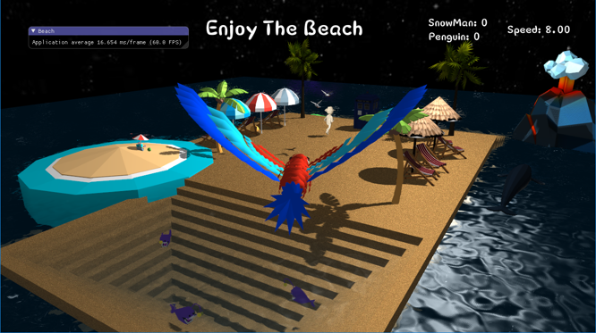
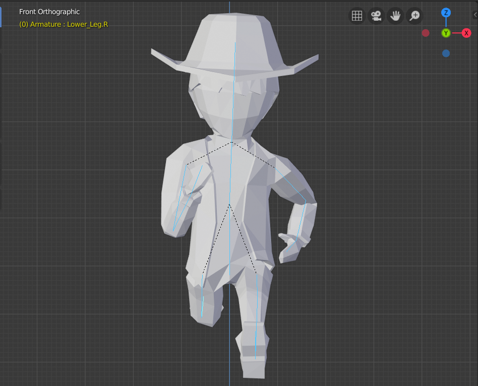

# Enjoy-The-Beach 项目个人报告
姓名：陈谱一

学号：16340026

专业：软件工程（数媒）

---

## 项目分工
对场景进行设计构思，制作并导入模型，编写PPT和项目文档

---

## 具体工作
### 1.场景设计
我在小组中主要负责设计工作，对整个场景进行构思和布置。我的项目灵感来源于现实生活中美丽的沙滩海景，利用OpenGL极大程度上还原了沙滩和海洋的场景。场景中有很多生活中沙滩上的元素，例如游客、大海、沙滩等。用户通过飞鸟的视角来观察整个场景，可以操控鸟的位置来调控视角。场景中利用多种技术尽可能模拟现实的沙滩，给用户带来极致的视觉体验。

### 2.模型导入和模型制作
场景中静止的动画可以直接导入，例如我为场景中导入了遮阳伞和躺椅等模型。但是对于动态的模型一般需要自己制作。为了完成骨骼动画的要求，我利用blender制作奔跑的人物模型。

制作骨骼动画模型主要分成以下几步：

#### 导入模型
- 首先在顶部选择文件，点击导入obj文件即可导入提供的模型。
- 调整模型的大小为一个立方体大小，另外调整模型的位置。

#### 创建骨架
- 按shift+A选择骨架即可创建一个骨架。
- 将骨架放在模型中心，作为父骨架。
- 选择骨架头和骨架尾，按G调整骨架的位置和大小。
- 按E生产新的子骨架，按上述方式为全身添加骨架。

#### 反向运动学
反向运动学主要添加在脚部，为腿的下半部分骨骼添加约束：
- 点击骨骼进入骨骼约束编辑界面。
- 选择目标和极向目标，并调整角度和链长。

这样就实现了底部骨骼之间的约束，可以通过leg IK.L和pole target.L两个骨骼来控制腿部的动作，包括位移，弯曲等。

#### 权重绘制

- 选中模型，然后选择权重绘制，通过调整不同的部分的权重来控制动作。
- 进入物体模式，选择模型，按shift选中骨骼，再按ctrl+P选择附带自动权重。那么权重会按照模型的骨骼自动分配，如果有部分权重没有分配，再按第一步的方法调整。例如我的脚底部分有部分模型和骨骼没有关联，通过增加权重解决问题。

#### 创建循环动画
- 为走路的过程创建五个关键帧，插入关键帧形成动作。
- 选择Nolinear Animation编辑器，新建一个动作块，调整重复次数和动作范围。
- 点击播放按钮开始循环动画。

---

## 个人感想
1. 这次作业我完成的代码部分并不是很多，主要负责了构思和文档编写。虽然任务并不是特别繁重，但我还是非常认真地逐一按时完成，在制作和添加模型的过程中我也遇到了很多困难，通过和组员沟通以及上网查找教程，最后都成功解决。在这个过程中我学习了很多和计算机图形学相关的知识，收获颇丰。
2. 我要特别感谢我的组员，他们在整个项目完成过程中都是积极主动，我们可以很好地配合交流，遇到不懂的问题都可以很快解决。我觉得整个开发过程是比较顺利的，我也非常喜欢这样的团队氛围。
3. 正如老师所说，计算机图形学这门课程代码量非常大，对一般的同学来说有些难度，这一点我深切感受到了。但是一学期下来我学到的东西是其他课程无法给予的。最后的大作业是对之前所有知识点的回顾和汇总，在完成这次大作业之后可以说为这门课程画上了圆满的句号。
