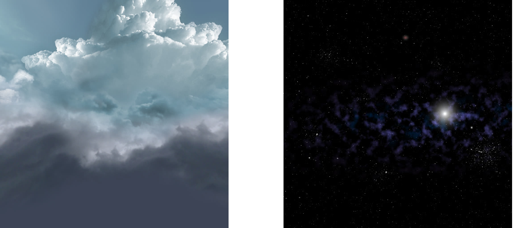
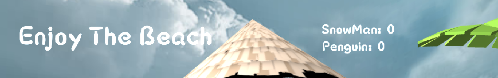
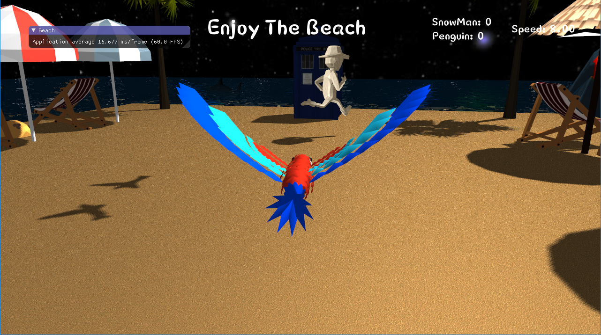
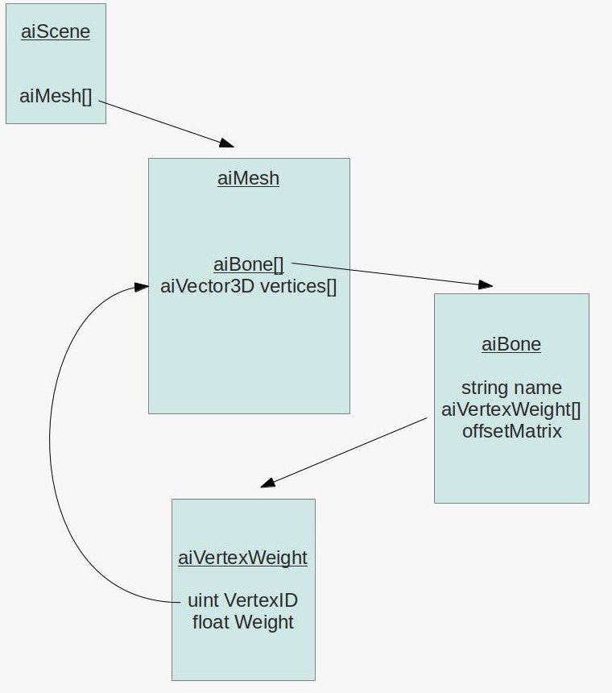
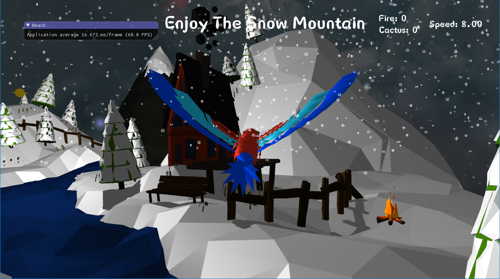
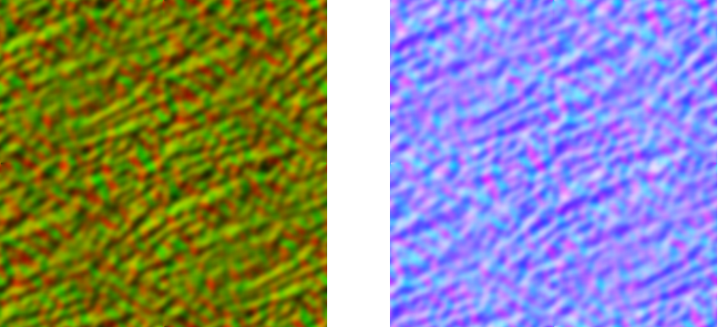
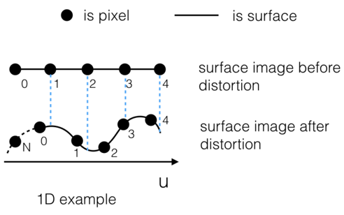
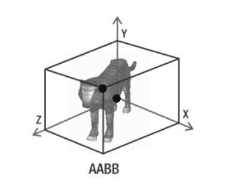

# Enjoy-The-Beach

## 简介

此项目实现了一个在沙滩与雪山场景下的游戏，按下`3`键可切换场景中的光源，按下`1`与`2`键可以关闭与开启通过粒子系统实现的飞雪效果，按下`4`键可切换 Gamma 校正的效果。

### 玩法

玩家通过 `WASD` 键与鼠标控制鸟在场景中进行移动，在一个场景中找到另一场景中的4个关键物体后走到 TARDIS 中即可切换到另一场景。


## 开发环境与第三方库

### 开发环境

项目使用 CMake 进行构建，在 Mac 下使用 clang 编译，在 Windows 下生成 Visual Studio 解决方案后构建。构建方法如下：

通过如下命令拉取项目与依赖的源码：

```shell
git clone https://github.com/sysu-cg-group11/Enjoy-The-Beach.git --recursive
```

项目可以在 Windows 或 macOS 下运行，使用 cmake 进行构建，在 macOS 下的构建与运行的命令如下：

```shell
mkdir build && cd build
cmake ..
make -j 8
./bin/Enjoy-Beach-macos
```

在 Windows 下创建并进入 build 目录后，在目录下通过如下命令创建 Visual Studio 解决方案：

```shell
cmake .. -G "Visual Studio 15 2017 Win64"
```

创建后，将`build\dependencies\assimp\include\assimp\config.h`拷贝至项目根目录中的`dependencies\assimp\include\assimp`下。最后打开解决方案将`Enjoy-Beach-windows`设为启动项目便可编译运行。

### 第三方库

项目使用的第三方库已源码形式存于 dependencies 子模块下，项目构建时根据平台编译第三方库并链接至生成的可执行文件中。

使用的所有第三方库如下：

1. **GLFW**: 创建与管理窗口和 OpenGL 上下文，处理鼠标与键盘输入。
2. **GLM: ** 提供类似于 GLSL 中的数学运算类与函数
3. **assimp: **用于加载模型
4. **freetype: **用于显示文字
5. **glad: ** 用于加载 OpenGL 函数
6. **imgui: **用于创建 GUI 界面
7. **stb_image.h: ** 用于加载纹理图像


## 实现功能列表

实现的功能如下: 

### Basic

1. Camera Roaming

2. Simple lighting and shading(Blinn-Phong)

3. Texture mapping

4. Shadow mapping

5. Model import & Mesh viewing (Assimp)

### Bonus

1. Sky Box
2. Text Display
3. Gamma Correction
4. Skeletal Animation
5. Particle System
6. Fluid Simulation
7. Collision Detection


## 功能点简介

1. **Camera Roaming**

   用户通过键盘输入移动摄像机的位置，并可通过鼠标移动来控制摄像机视角，以实现从不同角度观察场景。

   ​

2. **Light and Shading**

   场景中添加了太阳光源，使用了 Blinn-Phong 光照模型来为场景添加光照。

   对同一个视角切换光照位置后光照与阴影的效果如下：

   *沙滩：*

   

   

   *雪山：*

   

   

   流体水面使用的是 Phong 光照模型，效果如下：

   

   ​

3. **Texture Mapping: **

   为模型添加不同的纹理，使模型可显示出更加真实的表面细节：

   

   ​

4. **Model import & Mesh viewing:**

   通过加载模型来实现两个场景中不同实体的实现。例如如下的 TARDIS：

   

   ​

5. **Shadow Mapping:**

   通过光源视角渲染获得深度贴图，在渲染时可根据深度贴图判断点是否在光照范围之内，从而生成阴影效果。项目中也是用了阴影偏移与 PCF 来改良效果。在两个场景中的阴影效果如下：

   *沙滩：*

   

   ​

   *雪山：*

   

   ​

6. **Gamma Correction**: 

   可通过 OpenGL 内建的方式开启 Gamma Correction:

   ```cpp
   glEnable(GL_FRAMEBUFFER_SRGB);
   ```

   也可通过着色器启用 Gamma 校正:

   ```cpp
   objectColor = pow(texture(diffuseTexture, fs_in.TexCoords).rgb, vec3(gamma));
   ```

   其效果分别如下：

   未开启 Gamma 校正时：

   

   使用 OpenGL 内建的`GL_FRAMEBUFFER_SRGB`进行 Gamma 校正效果：

   

   在着色器中对纹理进行 Gamma 校正，并对 SRGB 纹理进行重校后的效果：

   

   可见应用 Gamma 校正后，显示图像的颜色更加真实，过暗与过亮的情况减少。

   ​

7. 天空盒

   为项目加入两种天空盒：

   

   天空盒主要靠cubemap来实现，而我们为场景提供了两套cubemap的texture，并依据场景的时间变化，将时间参数传递给着色器，渲染出的颜色根据两套texture决定，这样就实现了场景的昼夜更替。

   除此之外，我们还修改了传递给天空盒着色器的view矩阵。通过将其最后一列设置为0使摄像机永远处在天空盒中心，通过给view矩阵施加一个旋转变换使其随时间流逝而自然旋转，来模拟云层的流动。

   ​

8. 字体显示

   

   文字显示使用了`freetype`库，在渲染文字前首先需要定义文字显示的信息结构体：

   ```c++
   struct Character {
       GLuint TextureID;   // ID handle of the glyph texture
       glm::ivec2 Size;    // Size of glyph
       glm::ivec2 Bearing;  // Offset from baseline to left/top of glyph
       GLuint Advance;    // Horizontal offset to advance to next glyph
   };
   ```

   在每一渲染一个单独的文字时，根据文字对应的字母，首先需要将其转换成`Character`类对象，这部分`freeetype`库已经帮我们完成了：

   ```c++
   Character ch = this->Characters[*c]; // *c即为一个字符
   ```

   获取到字符对应的`Character`对象之后，根据`freetype`二维渲染样式，只需要通过创建固定格式的VAO，VBO即可完成渲染过程：

   ```c++
   GLfloat xpos = postion.x + ch.Bearing.x * scale;
   GLfloat ypos = postion.y - (ch.Size.y - ch.Bearing.y) * scale;

   GLfloat w = ch.Size.x * scale;
   GLfloat h = ch.Size.y * scale;
   // Update VBO for each character
   GLfloat vertices[6][4] = {
       {xpos,     ypos + h, 0.0, 0.0},
       {xpos,     ypos,     0.0, 1.0},
       {xpos + w, ypos,     1.0, 1.0},

       {xpos,     ypos + h, 0.0, 0.0},
       {xpos + w, ypos,     1.0, 1.0},
       {xpos + w, ypos + h, 1.0, 0.0}
   };
   // Render glyph texture over quad
   glBindTexture(GL_TEXTURE_2D, ch.TextureID);
   // Update content of VBO memory
   glBindBuffer(GL_ARRAY_BUFFER, this->fontVBO);
   glBufferSubData(GL_ARRAY_BUFFER, 0, sizeof(vertices),
   					vertices); // Be sure to use glBufferSubData and not glBufferData

   glBindBuffer(GL_ARRAY_BUFFER, 0);
   // Render quad
   glDrawArrays(GL_TRIANGLES, 0, 6);
   // Now advance cursors for next glyph (note that advance is number of 1/64 pixels)
   postion.x += (ch.Advance >> 6) * scale;
   ```
   ​

9. 骨骼动画（沙滩上跑步的人）

   

   骨骼动画的实现参考了`ogldev`官网的教程实现，下面介绍骨骼动画的实现原理和处理过程：

   1. 此处的骨骼动画实现支持`.fbx`动画模型的导入，通过循环渲染原本骨骼动画模型的骨架移动，通过权重影响到模型每个顶点的坐标，从而实现模型的动态运动。

      具体骨骼动画模型的数据读取和存储基本按照Assimp库的结构体和接口进行，关系示意图如下：

      

      ​

   2. 首先模型通常是由多个三角形形成的网格构成, 每个三角形有三个顶点, 因此动画的根本原理就在于不同时间内为每个顶点分配不同的位置, 这一切都是通过虚拟的骨骼(bone)实现的. 其中模型上的每个顶点分配给不同的骨骼，每个骨骼对不同顶点有不同的影响, 这通过权重值来实现的。

      ​

   3. 动画模型文件中不仅包含描述顶点的数据信息，还包含骨骼Bone在不同动画帧内的变换矩阵，模型上的顶点首先要变换至骨骼所在的模型空间, 而后再乘以其相应的变换矩阵。从而在不同的动画帧内计算所有顶点的对应坐标位置，进而进行模型渲染。动画模型文件中不仅包含描述顶点的数据信息，还包含骨骼Bone在不同动画帧内的变换矩阵，模型上的顶点首先要变换至骨骼所在的模型空间, 而后再乘以其相应的变换矩阵。从而在不同的动画帧内计算所有顶点的对应坐标位置，进而进行模型渲染。

      ​


   ​

10. 粒子系统（雪山场景中的落雪）

   

   粒子系统的实现的主要过程为：定义粒子结构体存储每个粒子的位置，大小，速度，方向，以及年龄信息，在主渲染函数中，通过随机生成粒子位置(当然一般下雪的话粒子位置都是在上方)，根据时间实时更新粒子的位置，实现缓慢落下的功能，当粒子的年龄到达范围时，将该粒子移除，生成新的粒子，重复上述操作，即可实现下雪的效果。

   ```c++
   struct SnowParticle
   {
   	float type;
   	glm::vec3 position;
   	glm::vec3 velocity;
       glm::vec3 direction;
   	float lifetimeMills;//年龄
   	float size;//粒子点精灵大小
   };
   ```

   ​

   粒子系统渲染函数，实际上增加了定时器，用于检测当前粒子的年龄是否超过限制，同时调用的粒子更新函数，实时添加新粒子：

   ```c++
   void Snow::Render(float frametimeMills, glm::mat4& worldMatrix,
   	glm::mat4 viewMatrix, glm::mat4& projectMatrix)
   {
   	mTimer += frametimeMills*1000.0f;
   	UpdateParticles(frametimeMills*1000.0f);
   	RenderParticles(worldMatrix, viewMatrix, projectMatrix);
   	mCurVBOIndex = mCurTransformFeedbackIndex;
   	mCurTransformFeedbackIndex = (mCurTransformFeedbackIndex + 1) & 0x1;
   }
   ```
   ​

11. 流体模拟（场景周围的水，具有流动与倒影的效果）

    流体模拟基于du/dv map和normal map实现。它们是如下两张图：

    

    这种方法是修改图像中的一些像素，给人以“立体”的错觉，主要适用于水面高度可以忽略的场景，如水池、河水一类。

    首先需要创建帧缓冲对象FBO，渲染场景时，利用glClipDistance分别将水面上方和下方渲染至两个FBO中（做texture），将这两张纹理图片按比例合成后可得到水面上对场景的反射、折射效果。

    接着利用du/dv map为水面加上波纹效果。du/dv map实际上就是保存着像素的一些扭曲（distortion）程度，将这种扭曲渲染到水面上就呈现出波纹效果。如：

    

    因为水面实际上并没有扭曲，所以各点的法向量是一样的，此时就需要利用与du/dv map对应的normal map提供的法向量来进行水面对光的反射效果的渲染。最终效果：

    


12. 碰撞检测 (玩家飞鸟模型与收集物品的碰撞检测)

    * 在飞鸟和企鹅、雪人之间加入碰撞检测，当发生碰撞时计分加一，找到所有的企鹅和雪人后进入TARDIS即可进入雪山场景。

      雪山场景中对飞鸟和火焰、仙人掌之间加入碰撞检测，找到所有的火焰和仙人掌进入TARDIS即可回到沙滩场景。

      ​


    * 此处我们使用的是基础的AABB盒检测，为了简化物体之间的碰撞检测运算，通常会对物体创建一个规则的几何外形将其包围其中，AABB（axis-aligned bounding box）包围盒是碰撞检测中较为常用的算法。

      ​

    * 三维场景中的AABB包围盒特点：（1） 表现形式为六面体。（2） 六面体中的每条边都平行于一个坐标平面。

      

      ​

    * 首先为所有可能与玩家发生碰撞的模型建立不同的碰撞盒，具体的碰撞盒存储内容为：碰撞盒的中心，碰撞盒在三维上的边长。之后在OpenGL的主渲染流程中进行碰撞检测函数的执行，具体内容为：

      1. 遍历当前所有的碰撞盒对象，计算当前摄像机坐标的x,y,z坐标分别与碰撞盒中心的x,y,z坐标的直线距离。			
      2. 若三个维度上的直线距离均分别小于对应碰撞盒边长的1/2，则视为碰撞发生。


## 遇到的问题和解决方案

1. 问题一：由于之前显示沙滩时，采用多个正方体渲染沙滩贴图的方式进行沙滩场景的构建，这一步实际上是在着色器中添加`offset`参数实现的，但此操作影响了`Shadow Mapping`的正常显示，但是在实现阴影渲染之后，无法在沙滩上看见物体的影子。

   解决方案：由于之前只在显示物体位置时考虑了`offset`参数，而没有在渲染阴影贴图的时候也考虑进去，导致实际上渲染阴影的位置只有一处，并没有相应地结合本身的偏移量，于是需要在着色器中添加如下代码片段：

   ```C++
   // aOffset即为传入的偏移量
   vec4 worldPosition = model * vec4(aPos + aOffset, 1.0f);
   gl_ClipDistance[0] = dot(worldPosition, plane);
   ```

   ​

2. 问题二：项目开始初期，由于制作目标的不确定，项目进度拖延了一段时间。实际上队员们也有查看了很多优秀的项目实例，例如：地形生成引擎，高仿MC的小游戏等等，都可以在这些项目中看到优秀的功能特效，但由于代码风格和依赖环境不同，导致这些项目实例的优秀功能实现部分，是不能与`OpenGL + GLFW + GLAD`环境相互结合的，有些甚至会使用额外的依赖库。

   解决方案：切换思路，这些优秀功能的实现固然是好，但我们需要做的只是借鉴其思想，再结合功能实现的基本过程，自己一步一步地重新实现当前环境下的目标功能。


## 小组成员分工

|  成员  |                             分工                             | 贡献率 |
| :----: | :----------------------------------------------------------: | :----: |
| 陈慕远 | 设计项目玩法模式，完成天空盒渲染，流体模拟功能的添加，协助模型的制作和导入过程。 |  28%   |
| 陈明亮 | 完成摄像机系统，纹理渲染，模型导入等基础功能。添加粒子系统，文字渲染，骨骼动画，碰撞检测功能。 |  28%   |
| 陈铭涛 | 完成光照系统，阴影渲染功能，添加复杂光照中的Gamma校正，完善碰撞检测。 |  28%   |
| 陈谱一 |    对场景进行设计构思，制作并导入模型，编写PPT和项目文档     |  16%   |

