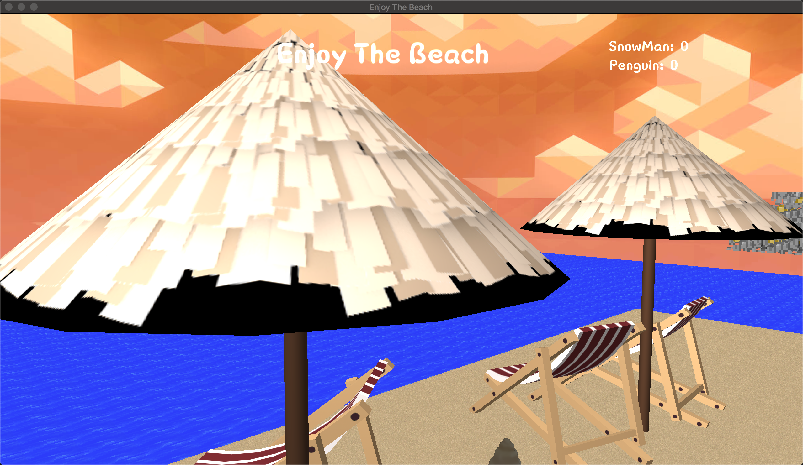

# Enjoy-The-Beach

## 简介

此项目实现了一个在沙滩与雪山场景下的游戏，按下`3`键可切换场景中的光源，按下`1`与`2`键可以关闭与开启通过粒子系统实现的飞雪效果，按下`4`键可切换 Gamma 校正的效果。

### 玩法

玩家通过 `WASD` 键与鼠标控制鸟在场景中进行移动，在一个场景中找到另一场景中的4个关键物体后走到 TARDIS 中即可切换到另一场景。

## 开发环境与第三方库

### 开发环境

项目使用 CMake 进行构建，在 Mac 下使用 clang 编译，在 Windows 下生成 Visual Studio 解决方案后构建。构建方法如下：

通过如下命令拉取项目与依赖的源码：

```shell
git clone https://github.com/sysu-cg-group11/Enjoy-The-Beach.git --recursive
```

项目可以在 Windows 或 macOS 下运行，使用 cmake 进行构建，在 macOS 下的构建与运行的命令如下：

```shell
mkdir build && cd build
cmake ..
make -j 8
./bin/Enjoy-Beach-macos
```

在 Windows 下创建并进入 build 目录后，在目录下通过如下命令创建 Visual Studio 解决方案：

```shell
cmake .. -G "Visual Studio 15 2017 Win64"
```

创建后，将`build\dependencies\assimp\include\assimp\config.h`拷贝至项目根目录中的`dependencies\assimp\include\assimp`下。最后打开解决方案将`Enjoy-Beach-windows`设为启动项目便可编译运行。

### 第三方库

项目使用的第三方库已源码形式存于 dependencies 子模块下，项目构建时根据平台编译第三方库并链接至生成的可执行文件中。

使用的所有第三方库如下：

1. **GLFW**: 创建与管理窗口和 OpenGL 上下文，处理鼠标与键盘输入。
2. **GLM: ** 提供类似于 GLSL 中的数学运算类与函数
3. **assimp: **用于加载模型
4. **freetype: **用于显示文字
5. **glad: ** 用于加载 OpenGL 函数
6. **imgui: **用于创建 GUI 界面
7. **stb_image.h: ** 用于加载纹理图像

## 实现功能列表

实现的功能如下: 

### Basic

1. Camera Roaming

2. Simple lighting and shading(Blinn-Phong)

3. Texture mapping

4. Shadow mapping

5. Model import & Mesh viewing (Assimp)

### Bonus

1. Sky Box
2. Text Display
3. Gamma Correction
4. Skeletal Animation
5. Particle System
6. Fluid Simulation

## 功能点简介

1. **Camera Roaming**

   用户通过键盘输入移动摄像机的位置，并可通过鼠标移动来控制摄像机视角，以实现从不同角度观察场景。

2. **Light and Shading**

   场景中添加了太阳光源，使用了 Blinn-Phong 光照模型来为场景添加光照。

   对同一个视角切换光照位置后光照与阴影的效果如下：

   *沙滩：*

   

   

   *雪山：*

   

   

   流体水面使用的是 Phong 光照模型，效果如下：

   

3. **Texture Mapping: **

   为模型添加不同的纹理，使模型可显示出更加真实的表面细节：

   

4. **Model import & Mesh viewing:**

   通过加载模型来实现两个场景中不同实体的实现。例如如下的 TARDIS：

   

5. **Shadow Mapping:**

   通过光源视角渲染获得深度贴图，在渲染时可根据深度贴图判断点是否在光照范围之内，从而生成阴影效果。项目中也是用了阴影偏移与 PCF 来改良效果。在两个场景中的阴影效果如下：

   *沙滩：*

   

   *雪山：*

   

6. **Gamma Correction**: 

   可通过 OpenGL 内建的方式开启 Gamma Correction:

   ```cpp
   glEnable(GL_FRAMEBUFFER_SRGB);
   ```

   也可通过着色器启用 Gamma 校正:

   ```cpp
   objectColor = pow(texture(diffuseTexture, fs_in.TexCoords).rgb, vec3(gamma));
   ```

   其效果分别如下：

   未开启 Gamma 校正时：

   

   使用 OpenGL 内建的`GL_FRAMEBUFFER_SRGB`进行 Gamma 校正效果：

   

   在着色器中对纹理进行 Gamma 校正，并对 SRGB 纹理进行重校后的效果：

   

   可见应用 Gamma 校正后，显示图像的颜色更加真实，过暗与过亮的情况减少。

7. 天空盒

   为项目加入两种天空盒：

   

   天空盒主要靠cubemap来实现，而我们为场景提供了两套cubemap的texture，并依据场景的时间变化，将时间参数传递给着色器，渲染出的颜色根据两套texture决定，这样就实现了场景的昼夜更替。

   除此之外，我们还修改了传递给天空盒着色器的view矩阵。通过将其最后一列设置为0使摄像机永远处在天空盒中心，通过给view矩阵施加一个旋转变换使其随时间流逝而自然旋转，来模拟云层的流动。

8. 字体显示

9. 骨骼动画（沙滩上跑步的人）

10. 粒子系统（雪山场景中的落雪）

11. 流体模拟（场景周围的水，具有流动与倒影的效果）

    流体模拟基于du/dv map和normal map实现。它们是如下两张图：

    

    这种方法是修改图像中的一些像素，给人以“立体”的错觉，主要适用于水面高度可以忽略的场景，如水池、河水一类。

    首先需要创建帧缓冲对象FBO，渲染场景时，利用glClipDistance分别将水面上方和下方渲染至两个FBO中（做texture），将这两张纹理图片按比例合成后可得到水面上对场景的反射、折射效果。

    接着利用du/dv map为水面加上波纹效果。du/dv map实际上就是保存着像素的一些扭曲（distortion）程度，将这种扭曲渲染到水面上就呈现出波纹效果。如：

    

    因为水面实际上并没有扭曲，所以各点的法向量是一样的，此时就需要利用与du/dv map对应的normal map提供的法向量来进行水面对光的反射效果的渲染。最终效果：

    


## 遇到的问题和解决方案


## 小组成员分工

|  成员  |                             分工                             | 贡献率 |
| :----: | :----------------------------------------------------------: | :----: |
| 陈慕远 | 设计项目玩法模式，完成天空盒渲染，流体模拟功能的添加，协助模型的制作和导入过程。 |        |
| 陈明亮 | 完成摄像机系统，纹理渲染，模型导入等基础功能。添加粒子系统，文字渲染，骨骼动画，碰撞检测功能。 |        |
| 陈铭涛 | 完成光照系统，阴影渲染功能，添加复杂光照中的Gamma校正，完善碰撞检测。 |        |
| 陈谱一 |    对场景进行设计构思，制作并导入模型，编写PPT和项目文档     |  15%   |

