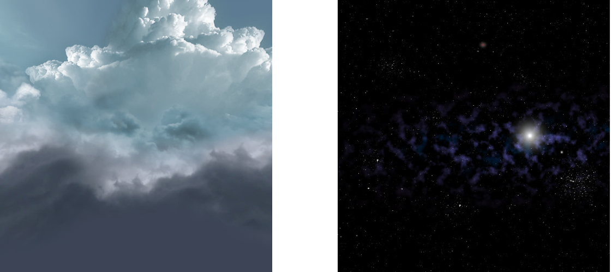

# Enjoy-The-Beach 项目个人报告

### 个人信息

- 学号：16340025
- 姓名：陈慕远
- Github：Krazymud

在本次项目中，我主要负责天空盒与流体模拟部分的实现与优化，接下来就来着重讲讲这两部分的实现过程。

### 天空盒

为了实现白天盒黑夜交替出现的效果，我们加入了两种天空盒：

- 模拟晴天的天空

- 模拟夜晚的星空

天空盒主要靠cubemap来实现，而我们为场景提供了两套cubemap的texture，并依据场景的时间变化，将时间参数传递给着色器，渲染出的颜色根据两套texture决定，这样就实现了场景的昼夜更替。

除此之外，我们还修改了传递给天空盒着色器的view矩阵。通过将其最后一列设置为0使摄像机永远处在天空盒中心，通过给view矩阵施加一个旋转变换使其随时间流逝而自然旋转，来模拟云层的流动。

### 流体模拟

目标：

- 进行流体模拟，做出流动的效果，尽可能还原现实生活中的水面。

- 除了流动效果，还需添加倒影和反光的效果。

流体模拟基于du/dv map和normal map实现。它们是如下两张图：

这种方法是修改图像中的一些像素，给人以“立体”的错觉，主要适用于水面高度可以忽略的场景，如水池、河水一类。

首先需要创建帧缓冲对象FBO，渲染场景时，利用glClipDistance分别将水面上方和下方渲染至两个FBO中（做texture），将这两张纹理图片按比例合成后可得到水面上对场景的反射、折射效果。

接着利用du/dv map为水面加上波纹效果。du/dv实际上就是保存着像素的一些扭曲（distortion）程度，将这种扭曲渲染到水面上就呈现出波纹效果，其原理如下：

因为水面实际上并没有扭曲，所以各点的法向量是一样的，此时就需要利用与du/dv map对应的normal map提供的法向量来进行水面对光的反射效果的渲染。