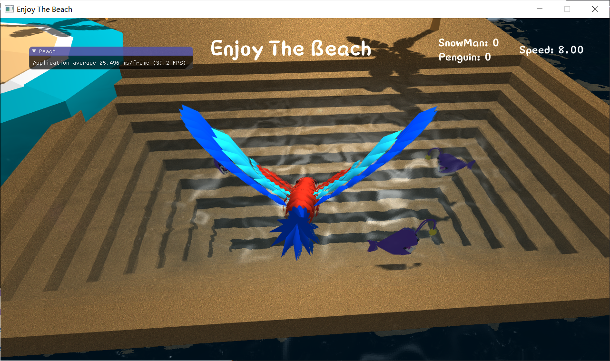

# Enjoy-The-Beach 项目个人报告

### 个人信息

- 学号：16340025
- 姓名：陈慕远
- Github：Krazymud

在本次项目中，我主要负责天空盒与流体模拟部分的实现与优化，接下来就来着重讲讲这两部分的实现过程。


### 天空盒

为了实现白天盒黑夜交替出现的效果，我们加入了两种天空盒：

- 模拟晴天的天空

- 模拟夜晚的星空


天空盒主要靠cubemap来实现，它是一个包含了6个2D纹理的纹理，每个2D纹理都组成了立方体的一个面，最终形成一个有纹理的立方体。首先声明两套纹理贴图路径：

```c++
std::vector<std::string> faces{
        "../resources/textures/skybox/right.jpg",
        "../resources/textures/skybox/left.jpg",
        "../resources/textures/skybox/top.jpg",
        "../resources/textures/skybox/bottom.jpg",
        "../resources/textures/skybox/back.jpg",
        "../resources/textures/skybox/front.jpg"
};

std::vector<std::string> night_faces{
        "../resources/textures/nightSky/right.jpg",
        "../resources/textures/nightSky/left.jpg",
        "../resources/textures/nightSky/top.jpg",
        "../resources/textures/nightSky/bottom.jpg",
        "../resources/textures/nightSky/back.jpg",
        "../resources/textures/nightSky/front.jpg"
};
```

之后需要生成纹理，绑定至纹理目标上，因为是cubemap所以需要绑定至GL_TEXTURE_CUBE_MAP：

```c++
unsigned int textureID;
glGenTextures(1, &textureID);
glBindTexture(GL_TEXTURE_CUBE_MAP, textureID);
//接着加载贴图，设置环绕过滤等等...
```

在这里加载两套cubemap做准备：

```c++
cubemapTexture = CubeRender::loadCubemap(faces);
cubemapTexture2 = CubeRender::loadCubemap(night_faces);
```

这两套纹理如何切换呢？为了模仿从白天到夜晚的切换，需要编写一套简单的时间系统，在这里我将昼夜循环的时间设置为24s，并在不同的时间段以不同的参数组合两套cubemap纹理：

```c++
//Calculating day & night
timeing += deltaTime * 1000;
timeing = fmod(timeing, 24000);
int texture1;
int texture2;
float blendFactor;
if (timeing >= 0 && timeing < 5000) {
	texture1 = cubemapTexture2;
	texture2 = cubemapTexture2;
	blendFactor = (timeing - 0) / float((5000 - 0));
} else if (timeing >= 5000 && timeing < 8000) {
	texture1 = cubemapTexture2;
    texture2 = cubemapTexture;
    blendFactor = (timeing - 5000) / float((8000 - 5000));
} else if (timeing >= 8000 && timeing < 21000) {
    texture1 = cubemapTexture;
    texture2 = cubemapTexture;
    blendFactor = (timeing - 8000) / float((21000 - 8000));
} else {
    texture1 = cubemapTexture;
    texture2 = cubemapTexture2;
    blendFactor = (timeing - 21000) / float((24000 - 21000));
}
```

其中，blendFactor作为一个参数传递给天空盒对应的着色器，最终的颜色将有两套纹理混合计算得出：

```c++
vec4 texture1 = texture(skybox, TexCoords);
vec4 texture2 = texture(skybox2, TexCoords);
FragColor = mix(texture1, texture2, blendFactor);
```


除此之外，我们还修改了传递给天空盒着色器的view矩阵。通过将其最后一列设置为0使摄像机永远处在天空盒中心，通过给view矩阵施加一个旋转变换使其随时间流逝而自然旋转，来模拟云层的流动。view矩阵变换如下：

```c++
glm::mat4 tmp = view;
rotation += ROTATE_SPEED * deltaTime;
tmp[3] = glm::vec4(0.0);
tmp = glm::rotate(tmp, glm::radians(rotation), glm::vec3(0.0, 1.0, 0.0));
shader.SetMatrix4("view", tmp);
```


完成以上操作后，天空盒就可以缓慢自转，模拟云层的流动效果。同时，随着时间的变换，天空盒也会完成昼夜循环，这样就实现了一个较为真实的天空盒。


### 流体模拟

目标：

- 进行流体模拟，做出流动的效果，尽可能还原现实生活中的水面。

- 除了流动效果，还需添加倒影和反光的效果。

流体模拟基于du/dv map和normal map实现。它们是如下两张图：


这种方法是修改图像中的一些像素，给人以“立体”的错觉，主要适用于水面高度可以忽略的场景，如水池、河水一类。

首先需要创建帧缓冲对象FBO，渲染场景时，利用glClipDistance分别将水面上方和下方渲染至两个FBO中（做texture），将这两张纹理图片按比例合成后可得到水面上对场景的反射、折射效果。在本项目中，需要用glClipDistance处理的有天空盒与加载的场景模型。glClipDistance需在顶点着色器中应用：

```c++
uniform vec4 plane;
...
void main(){
    vec4 worldPosition = model * pos;
    gl_ClipDistance[0] = dot(worldPosition, plane);
    ...
}
```


此时水面还没有波纹与光反射、折射，看起来更像是一层镜面。接着利用du/dv map为水面加上波纹效果。du/dv map实际上就是保存着像素的一些扭曲（distortion）程度，将这种扭曲渲染到水面上就呈现出波纹效果，其原理如下：


在水面渲染的着色器中加入du/dv map处理：

```c++
//计算distortion
vec2 distortedTexCoords = texture(dudvMap, vec2(textureCoords.x + moveFactor, textureCoords.y)).rg * 0.1;
distortedTexCoords = textureCoords + vec2(distortedTexCoords.x, distortedTexCoords.y + moveFactor);
vec2 totalDistortion = (texture(dudvMap, distortedTexCoords).rg * 2.0 - 1.0) * waveStrength * clamp(waterDepth / 20.0, 0.0, 1.0);

//施加distortion于reflection和refraction
refractTexCoords += totalDistortion;
refractTexCoords = clamp(refractTexCoords, 0.001, 0.999);

reflectTexCoords += totalDistortion;
reflectTexCoords.x = clamp(reflectTexCoords.x, 0.001, 0.999);
reflectTexCoords.y = clamp(reflectTexCoords.y, -0.999, -0.001);

vec4 reflectColour = texture(reflectionTexture, reflectTexCoords);
vec4 refractColour = texture(refractionTexture, refractTexCoords);
```

其中，moveFactor为一个随着时间变换而变换的参数，由外部传入以使波纹呈现动态的效果。


因为水面实际上并没有扭曲，所以各点的法向量是一样的，如果直接利用顶点的法向量计算光照效果显然是错误的。此时就需要利用与du/dv map对应的normal map提供的法向量来进行水面对光的反射效果的渲染。在着色器中加入normal map处理：

```c++
//得到法向量
vec4 normalMapColour = texture(normalMap, distortedTexCoords);
vec3 normal = vec3(normalMapColour.r * 2.0 - 1.0, normalMapColour.b * 3.0, normalMapColour.g * 2.0 - 1.0);
normal = normalize(normal);

//计算光照
vec3 viewVector = normalize(toCameraVector);
float refractiveFactor = dot(viewVector, normal);
refractiveFactor = pow(refractiveFactor, 0.8);
refractiveFactor = clamp(refractiveFactor, 0.001, 0.999);

vec3 reflectedLight = reflect(normalize(fromLightVector), normal);
float specular = max(dot(reflectedLight, viewVector), 0.0);
specular = pow(specular, shineDamper);
vec3 specularHighlights = lightColour * specular * reflectivity * clamp(waterDepth / 5.0, 0.0, 1.0);	
```


最终效果：




### 个人感想

在本次项目中，我实现的部分都是属于bonus部分，所以首先需要感谢实现了其他部分的同学，是大家的通力合作才使得最终作品的效果和谐融洽。

项目的完成过程是一个不断思考与进步的过程，为了实现我自己的部分，我在learnOpengl网站上学习到了很多，也从别的博客或是视频中学到了很多，有了它们的帮助才得以实现这些功能。